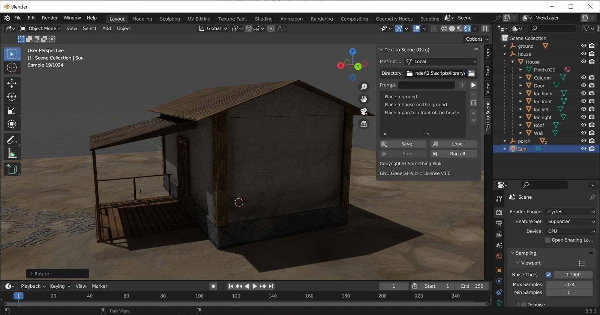

# Broomrocket for Blender: Open Source Text to 3D Scene

This Blender add-on provides the ability to specify prompts in human language and place meshes in Blender from an asset
library accordingly.

For example:

> Place a house.
> Place a table behind the house.
> Place a vase on the table behind the house.

The add-on supports dummy objects, a local asset library, and Sketchfab as mesh providers. It can be extended to add
more providers.

## Installation

**Supported Blender versions:** 3.5

To install this add-on, you will have to install the dependencies specified in [requirements.txt](requirements.txt) in
your Blender Python installation path. You can then load the [broomrocket-blender.py](broomrocket-blender.py) script in Blender and run it as an
add-on.

## License

The code of this repository is licensed under the [MIT license](LICENSE).

## Contact

Please check [something.pink](https://something.pink/contact/) for detailed contact information.
